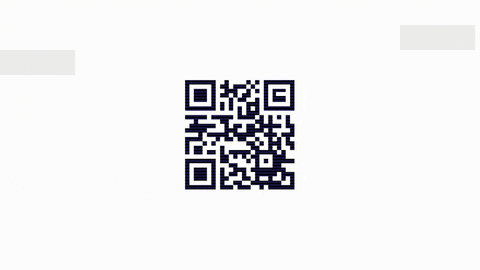

# ***QR CREATOR***

  

<b>-> Bu uygulama ile istediğiniz bilgi,döküman,web site vs vs herşeyi QR koda çevirebilirsiniz!</b>
  

-> Uygulama ana sayfasında QR koda gömmek istediğiniz bilgiyi giriniz.

-> QR kodu oluşturmak istediğiniz boyutu giriniz (ÖR: size:150 => 150x150 px'dir).
-> QR kod butonuna bastığınızda qr kodunuz oluşacaktır!!

-> Oluşan QR kodunuza bastığınızda QR Detay sayasına yönlendirileceksiniz. QR kodunuz büyüyecek ve indirme butonuyla indirebileceksiniz!
   

    

 
 

    

 
 

    

 
 

    

